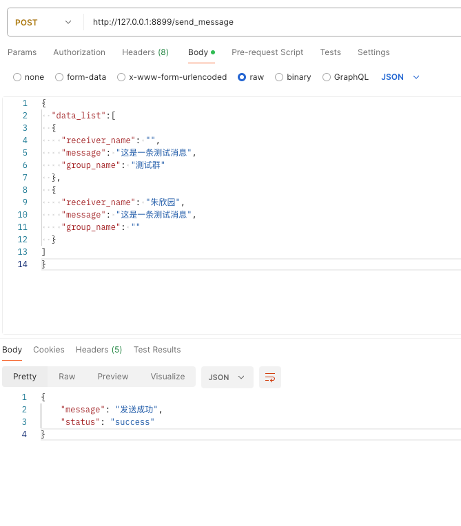
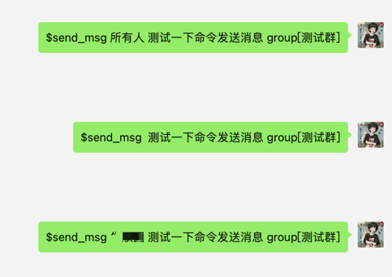
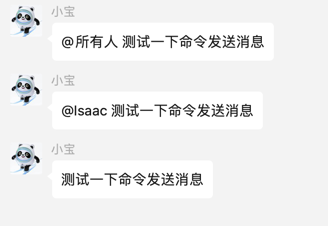

# file_writer 插件

## 简介

`file_writer` 插件用于[chatgpt-on-wechat](https://github.com/hanfangyuan4396/dify-on-wechat)项目。<br>
实现手动发送消息通知到微信功能，写入json消息数据到data.jaon文件里，

## python版本

python3.11 目前发现有低版本不兼容的问题，建议使用3.11版本

## 安装

此插件作为微信聊天机器人系统的一部分，需要将其放置在正确的插件目录下：

### 安装方法（三种方式）

下载插件,访问插件[仓库地址](https://github.com/Isaac20231231/file_writer)

#### 第一种:手动下载压缩包,将`file_writer` 文件夹复制到您的聊天机器人的 `plugins` 目录中。

#### 第二种:微信执行命令

   ```sh
   #installp https://github.com/Isaac20231231/file_writer.git
   #scanp
   ```

#### 第三种:进入`plugins` 目录克隆

```sh
git clone https://github.com/Isaac20231231/file_writer.git
```

### 注意事项

1. 确保 `__init__.py`,`file_writer.py`和`file_watcher.py` 文件位于 `file_writer` 文件夹中。
2. 安装插件相关依赖 `pip install -r requirements.txt`。

```sh
cd plugins/file_writer
pip install -r requirements.txt
```

## data.json文件介绍

`file_writer` 插件数据依赖于 `data.json` 文件进行写入。

   ```data.json
   [
   {
   "receiver_name": "",
   "message": "这是一条测试消息",
   "group_name": "测试群"
   }, 
   {
    "receiver_name": "小明",
    "message": "这是一条测试消息",
    "group_name": ""
   }
   ]
   ```

### 参数说明:

    - `receiver_name`: 接收者的微信备注名
    - `message`: 消息内容
    - `group_name`: 群聊名称

发送个人消息时，`group_name`为空，填写`receiver_name`,`message`即可。<br>
发送群聊消息时，`group_name`,`message`必填,`receiver_name`可选，填写`微信备注名`时，发送@某人消息，填写`所有人`
发送@所有人消息,不填写不@。

## 使用

安装并正确配置插件后，您可以通过以下方式使用：<br>
打开postman，请求api接口"http://127.0.0.1:5688/send_message"<br>
注意:
127.0.0.1是本机ip，如果是部署服务器要改成服务器ip地址，8899是端口号，如果修改了端口号要改成对应的端口号（端口号可以在run_flask_app()
修改端口启动）
发送消息到微信

```json
{
  "receiver_name": "",
  "message": "这是一条测试消息",
  "group_name": "测试群"
}
```

成功返回：

```json
{
  "message": "发送成功",
  "status": "success"
}
```

异常返回参考file_writer.py文件里的validate_data函数



# file_watcher插件介绍

## 第一种使用

file_watcher.py插件采用watchdog监听文件变化，和file_writer插件相互使用，<br>
file_writer负责写入文件，file_watcher负责监听文件，有内容时触发发送消息到微信。

### 命令说明

file_watcher支持以下命令：

- `$start watchdog` 开启监听
- `$stop watchdog` 停止监听
- `$check watchdog` 查看监听状态


### 使用方法

插件默认不启动监听，需要手动启动监听，监听文件为data.json文件，当data.json文件有内容时，触发发送消息到微信。
启动方式看上方,成功效果如下


## 第二种使用

file_watcher.py插件可以使用微信命令来发送消息到微信，不需要file_writer插件，<br>
发送消息分两种方式，一种是发送个人消息，一种是发送群聊消息。

### 命令说明

file_watcher支持以下命令(支持一次性发多人)：
- `$send_msg [微信备注名1,微信备注名2] 消息内容` 发送个人消息
- `$send_msg [微信备注名1,微信备注名2] 消息内容 group[群聊名称1,群聊名称2]` 发送群聊消息,并且@某人
- `$send_msg [所有人] 消息内容 group[群聊名称1,群聊名称2]` 发送群聊消息,并且@所有人
- `$send_msg [] 消息内容 group[群聊名称1,群聊名称2]` 发送群聊消息，不@任何人 注意:$send_msg后面是2个空格
  
  

## 联系作者

可以加微信:`isaac1999`,备注`加好友`<br>
自动通过好友后，发送`加插件问题讨论群`，拉你进插件问题群，有问题可以在群里提问。

## 贡献

如果您有任何改进意见或功能请求，请随时提交 Pull Request 或创建 Issue。

## 许可

请确保遵守相关的使用和分发许可。
